# Catalunya English - Hệ thống học tiếng Anh thông minh tích hợp AI

<div align="center">
  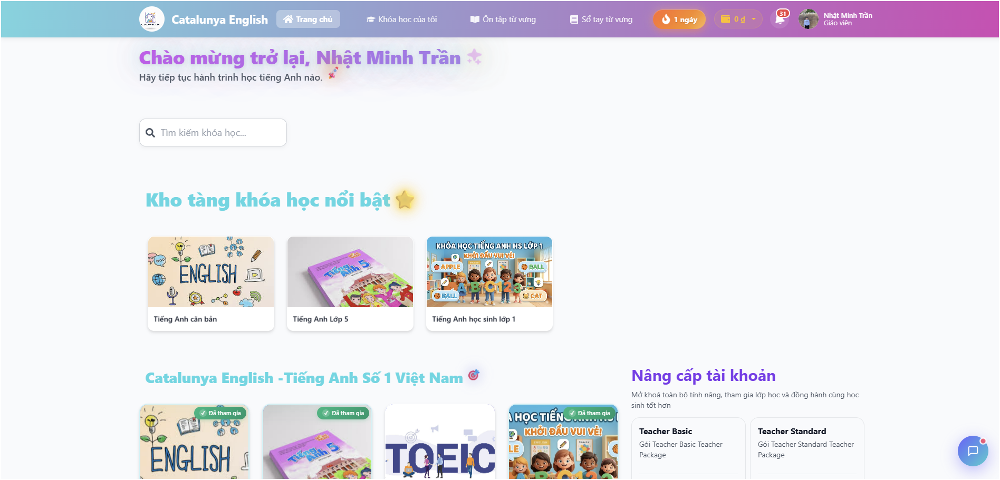
</div>

> **Website dự án:** [learning-eng.hocnghiepvu.com](https://learning-eng.hocnghiepvu.com)  
> **[Tiếng Việt](./README.md) | [English](./README.en.md)**

- **Live Demo:** https://learning-eng.hocnghiepvu.com  
- **Status:** Production  
- **Author:** Trần Nhật Minh  
- **Email:** nhatminh5224.forwork@gmail.com  

---

## ⚡ Quick Snapshot (15s Overview)

*   **Core:** AI-Powered English Learning SaaS (Hybrid Model).
*   **Tech Stack:** React 19 + .NET 8 + PostgreSQL (Pgvector).
*   **AI Engine:** RAG Chatbot (Semantic Kernel) + Azure Speech + Gemini.
*   **Adaptive:** Spaced Repetition (SM-2 Algorithm).
*   **Fintech:** Wallet system + PayOS Integration + Audit Trail.
*   **Architecture:** Structured Monolith (Clean Architecture) + DDD + SOLID.
*   **DevOps:** GitHub Actions (CI/CD) + Linux VPS (Nginx, Systemd).

---

## 🌍 1. Bối cảnh bài toán (The Problem)

Việc học tiếng Anh tại Việt Nam vẫn gặp nhiều hạn chế cốt lõi:
- **Thiếu linh hoạt**: Phụ thuộc trung tâm, thời gian cố định.
- **Không cá nhân hóa**: Lộ trình đại trà, không theo sát năng lực.
- **Chi phí cao**: Khó tiếp cận với số đông.
- **Thiếu công cụ tự luyện**: Đặc biệt là kỹ năng Speaking & Writing.
- **Giáo viên khó scale**: Giới hạn về không gian và công cụ quản lý.

---

## 💡 2. Đề tài & Giải pháp (The Solution)

Dựa trên bối cảnh đó, đề tài **"Xây dựng nền tảng Hybrid E-learning SaaS tích hợp AI"** được ra đời nhằm giải quyết triệt để các vấn đề trên thông qua:

- **Mô hình Hybrid**: Kết hợp Khóa học chuẩn (System) và Lớp riêng (Teacher) để tối ưu chi phí và tính cá nhân hóa.
- **AI-Powered**: Tận dụng AI (RAG, Azure Speech) để tạo công cụ tự luyện tập và tư vấn 24/7. Đặc biệt, hệ thống **RAG Chatbot** đóng vai trò là "tư vấn viên" thông minh, truy xuất tri thức từ kho dữ liệu nội bộ để phản hồi về:
    - 📚 Thông tin chi tiết và lộ trình các **Khóa học** (Courses).
    - 👨‍🏫 Quyền lợi và hạn mức của các **Gói dịch vụ Giáo viên** (Teacher Packages).
    - ⚖️ Các **Chính sách & Quy định** (Policies) vận hành của nền tảng.
- **Fintech & SaaS**: Chuyển đổi từ một web học tập sang một nền tảng kinh doanh giáo dục số, trao quyền cho giáo viên mở rộng quy mô.

---

## 🏗️ 3. Kiến trúc hạ tầng & Hệ thống (Infrastructure & Architecture)

Hệ thống được thiết kế theo mô hình **Hybrid Cloud Infrastructure**, tối ưu hóa bảo mật và hiệu suất thông qua các lớp điều phối kỹ thuật chuyên sâu:

### 🌐 3.1 Bản đồ hạ tầng (Infrastructure Map)

| Thành phần | Công nghệ | Trách nhiệm chính |
| :--- | :--- | :--- |
| **Bảo mật & DNS** | **Cloudflare** | Quản lý SSL/TLS, lá chắn WAF chặn DDoS và tối ưu hóa CDN. |
| **Reverse Proxy** | **Nginx** | Điều phối traffic, hỗ trợ **Byte-range requests** để stream media và giới hạn upload **300MB**. |
| **Frontend Server** | **Nginx Native** | Phục vụ mã nguồn React 19 (Static files), xử lý Routing thông qua `try_files`. |
| **Backend API** | **.NET 8 Kestrel** | Xử lý logic nghiệp vụ, chạy cô lập tại cổng 5030 trên Localhost để bảo mật. |
| **Object Storage** | **MinIO** | Lưu trữ tập trung tài nguyên Media (Video/Audio) tương thích chuẩn S3. |
| **Database** | **PostgreSQL** | Lưu trữ dữ liệu quan hệ và Vector tri thức cho AI (pgvector). |

### 📂 3.2 Cấu trúc dự án (Project Map - Clean Architecture)

Dự án áp dụng mô hình **Structured Monolith** với sự phân tách rõ rệt giữa logic nghiệp vụ và hạ tầng kỹ thuật:

```text
FSELearningEnglish/
├── BackendELearningEnglish/
│   ├── LearningEnglish.Domain/          # Heart: Chứa Entities, Enums, quy tắc nghiệp vụ cốt lõi.
│   ├── LearningEnglish.Application/     # Logic: Use-cases, DTOs, CQRS (MediatR), Validators.
│   ├── LearningEnglish.Infrastructure/  # Service: EF Core, MinIO, PayOS, AI Semantic Kernel.
│   └── LearningEnglish.API/             # Port: Controllers, Middlewares, Auth, Service Registry.
└── FrontElearningEnglish/               # UI: React 19, bootrap 5 , CSS, TanStack Query, Recharts.
```

---

## 🏗️ 4. Quy trình nghiệp vụ hệ thống (System Workflows - BPMN 2.0)

Để đảm bảo hệ thống vận hành ổn định và có khả năng chịu lỗi (Fault-tolerance), toàn bộ logic cốt lõi đã được chuẩn hóa bằng sơ đồ **BPMN 2.0**. Đây là tài liệu nền tảng giúp đội ngũ kỹ thuật hiểu sâu về luồng dữ liệu và các điểm rẽ nhánh nghiệp vụ.

- **Top-Up Flow**: Nạp tiền PayOS, xử lý Webhook Idempotency.  
  [[📄 File XML]](./Office/BPMN/TopUp_Flow.xml)
  <details>
    <summary>🖼️ Xem sơ đồ chi tiết &#38; Giải thích</summary>
    <br/>
    <ul>
      <li><b>Idempotency Check:</b> Sử dụng mã tham chiếu để đảm bảo một giao dịch nạp tiền không bị tính trùng hai lần khi nhận nhiều Webhook.</li>
      <li><b>Status Synchronization:</b> Đồng bộ trạng thái ví ngay lập tức sau khi xác thực chữ ký (Signature) từ cổng thanh toán.</li>
    </ul>
    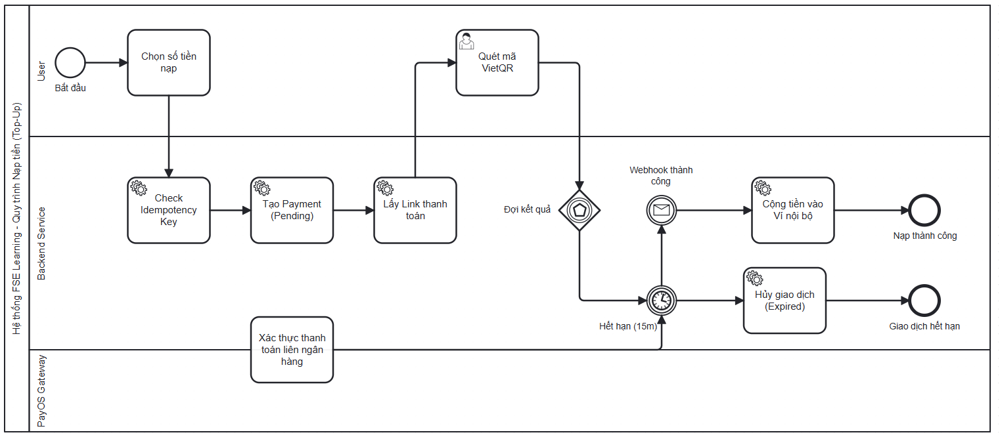
  </details>

- **Purchase Flow**: Giao dịch nguyên tử, đảm bảo nhất quán dữ liệu.  
  [[📄 File XML]](./Office/BPMN/Purchase_Flow.xml)
  <details>
    <summary>🖼️ Xem sơ đồ chi tiết &#38; Giải thích</summary>
    <br/>
    <ul>
      <li><b>Atomic Transaction:</b> Đảm bảo trừ tiền và cấp quyền khóa học phải xảy ra đồng thời. Nếu một bước lỗi, hệ thống sẽ Rollback toàn bộ.</li>
      <li><b>Audit Logging:</b> Ghi lại lịch sử biến động số dư (Balance Before/After) để phục vụ đối soát tài chính.</li>
    </ul>
    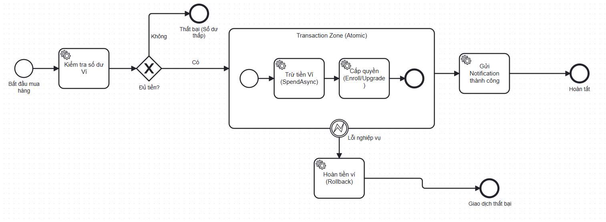
  </details>

### 🧠 4.2 Nhóm Học thuật & Thuật toán (Learning Engine)
- **Quiz Lifecycle**: Quản lý bài thi, Auto-save và Auto-submit.  
  [[📄 File XML]](./Office/BPMN/Quiz_Lifecycle.xml)
  <details>
    <summary>🖼️ Xem sơ đồ chi tiết &#38; Giải thích</summary>
    <br/>
    <ul>
      <li><b>Real-time Persistence:</b> Lưu trạng thái bài làm sau mỗi câu trả lời để tránh mất dữ liệu khi gặp sự cố mạng.</li>
      <li><b>Background Auto-Submit:</b> Sử dụng Background Task để tự động thu bài và chấm điểm ngay khi hết giờ làm bài.</li>
    </ul>
    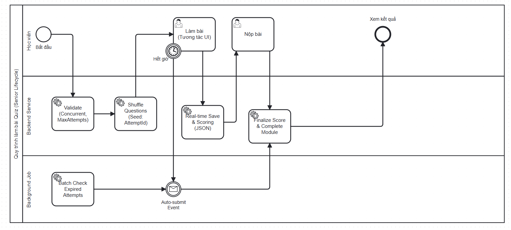
  </details>

- **Adaptive SRS**: Thuật toán SM-2 tối ưu hóa việc ghi nhớ.  
  [[📄 File XML]](./Office/BPMN/SRS_Adaptive_Learning.xml)
  <details>
    <summary>🖼️ Xem sơ đồ chi tiết &#38; Giải thích</summary>
    <br/>
    <ul>
      <li><b>SM-2 Implementation:</b> Tự động tính toán <i>Easiness Factor</i> và <i>Interval</i> dựa trên đánh giá độ khó của người dùng.</li>
      <li><b>Spaced Repetition:</b> Điều phối lịch ôn tập thông minh, giúp chuyển kiến thức từ bộ nhớ ngắn hạn sang dài hạn.</li>
    </ul>
    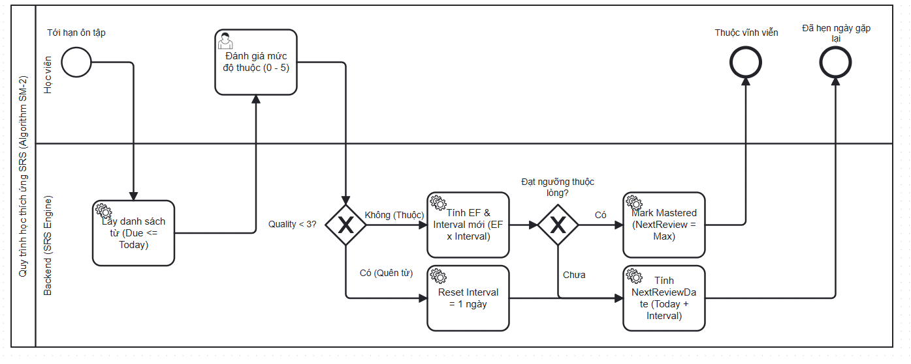
  </details>

### 🤖 4.3 Nhóm AI & Quản trị SaaS
- **AI Knowledge Hub (RAG)**: Truy xuất tri thức đa nguồn với Semantic Kernel.  
  [[📄 File XML]](./Office/BPMN/AI_RAG_Flow.xml)
  <details>
    <summary>🖼️ Xem sơ đồ chi tiết &#38; Giải thích</summary>
    <br/>
    <ul>
      <li><b>Multi-source Retrieval:</b> Tổng hợp tri thức từ Khóa học, Gói dịch vụ và Chính sách hệ thống để cung cấp phản hồi chính xác nhất.</li>
      <li><b>Context Augmentation:</b> Tối ưu hóa Prompt bằng cách chèn ngữ cảnh tri thức đã qua xử lý Vector Search.</li>
    </ul>
    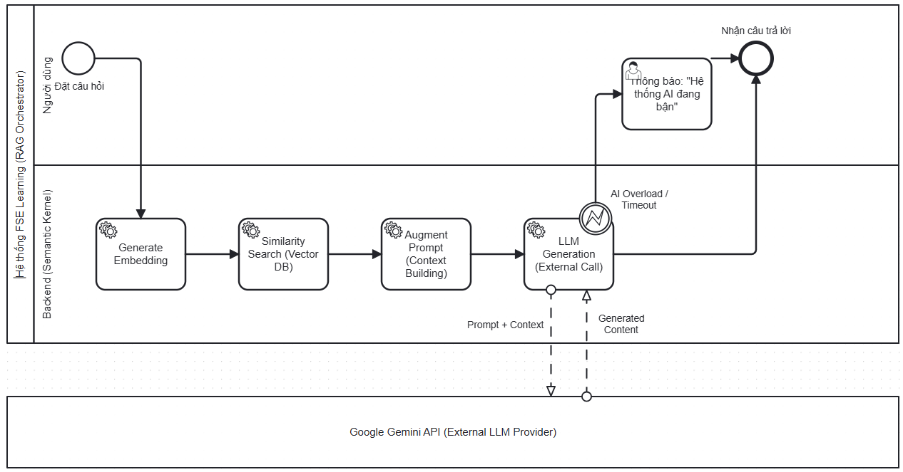
  </details>

- **SaaS Quota Governance**: Kiểm soát định mức tài nguyên giáo viên.  
  [[📄 File XML]](./Office/BPMN/SaaS_Quota_Governance.xml)
  <details>
    <summary>🖼️ Xem sơ đồ chi tiết &#38; Giải thích</summary>
    <br/>
    <ul>
      <li><b>Resource Enforcement:</b> Tự động hóa việc kiểm tra hạn mức (Số lượng học sinh, khóa học) dựa trên gói Subscription của giáo viên.</li>
      <li><b>Usage Analytics:</b> Cung cấp dữ liệu thời gian thực về việc sử dụng tài nguyên so với định mức đã mua.</li>
    </ul>
    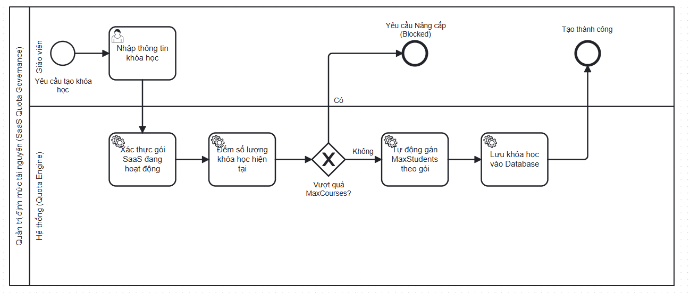
  </details>

### 🔐 4.4 Nhóm Bảo mật & Phân quyền
- **Identity Security**: Đăng ký OTP, chống Spam và bảo mật 5 lớp.  
  [[📄 File XML]](./Office/BPMN/Identity_Security_Flow.xml)
  <details>
    <summary>🖼️ Xem sơ đồ chi tiết &#38; Giải thích</summary>
    <br/>
    <ul>
      <li><b>Rate Limiting:</b> Sử dụng Memory Cache để tạo cơ chế Cooldown (60s) giữa các lần yêu cầu OTP, ngăn chặn Spam API.</li>
      <li><b>Brute-force Protection:</b> Tự động khóa mã OTP sau 5 lần nhập sai liên tiếp.</li>
    </ul>
    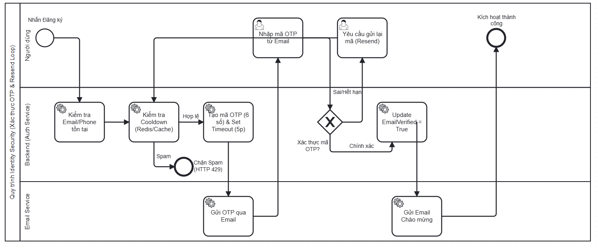
  </details>

- **RBAC Security**: Kiểm soát truy cập dựa trên Role-Based Access Control.  
  [[📄 File XML]](./Office/BPMN/RBAC_Security_Flow.xml)
  <details>
    <summary>🖼️ Xem sơ đồ chi tiết &#38; Giải thích</summary>
    <br/>
    <ul>
      <li><b>Middleware Authorization:</b> Kiểm tra quyền hạn (Permissions) thông qua Middleware trước khi yêu cầu chạm tới Controller.</li>
      <li><b>Dynamic Role Management:</b> Hỗ trợ thay đổi quyền hạn người dùng theo thời gian thực mà không cần khởi động lại hệ thống.</li>
    </ul>
    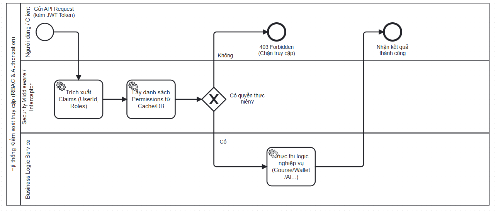
  </details>

> [!NOTE]  
> Toàn bộ các file thiết kế chuyên sâu nằm tại thư mục: [`Office/BPMN/`](./Office/BPMN/)

---
## 📄 5. Thiết kế Cơ sở dữ liệu (Database Design)

Hệ thống sử dụng **PostgreSQL** với hơn 40 thực thể được tổ chức khoa học, tập trung vào tính toàn vẹn dữ liệu và khả năng Audit (Kiểm toán).

> [!TIP]
> **Tài liệu Database chuyên sâu (Multi-format):**
> *   🌐 [**Bản vẽ tương tác (dbdiagram.io)**](https://dbdiagram.io/d/69f670d2c6a36f9c1be58625)
> *   🖼️ **Xem sơ đồ:** [Bản vẽ PNG](./Office/DB/Untitled.png) | [📐 Vector SVG (Khuyên dùng)](./Office/DB/Untitled.svg)
> *   📄 **Tài liệu offline:** [Bản in PDF](./Office/DB/Untitled.pdf) | [💾 Cấu trúc SQL Schema](./Office/DB/Untitled.sql)

### 💎 5.1 Trụ cột nghiệp vụ & Cấu trúc dữ liệu (Core Business Pillars)

| Module | Các thực thể chính (Entities) | Mối quan hệ cấu trúc dữ liệu |
| :--- | :--- | :--- |
| **🔐 Identity** | `User`, `Role`, `RolePermission` | Áp dụng RBAC, liên kết N-N giữa Role và Permission. |
| **📚 LMS Core** | `Course`, `Module`, `Lesson`, `Quiz` | Cấu trúc phân cấp 1-N chặt chẽ, tối ưu việc truy vấn nội dung học tập. |
| **📊 Adaptive** | `Progress`, `QuizResult` | Lưu vết lịch sử làm bài để tính toán tham số SM-2 (Interval, Repetition). |
| **💳 Fintech** | `Wallet`, `PaymentTransaction`, `WebhookQueue` | Lưu trữ Audit Trail với cơ chế Append-Only để đối soát lịch sử số dư. |
| **🧠 AI Vector** | `CourseKnowledge`, `PolicyKnowledge` | Tích hợp kiểu dữ liệu Vector (pgvector) để phục vụ AI Semantic Search. |
| **👩‍🏫 SaaS Mgr** | `TeacherPackage`, `TeacherSubscription` | Quản lý vòng đời gói dịch vụ giáo viên (Start Date, End Date, Quotas). |
| **📝 Evaluation** | `Essay`, `EssaySubmission`, `Pronunciation` | Liên kết giữa người học và kết quả đánh giá (Giáo viên chấm hoặc AI chấm). |

---

## 🚀 6. Kiến trúc & Công nghệ (Tech Stack &#38; Architecture)

Dự án được xây dựng theo mô hình **Client-Server** tách biệt, tối ưu hóa khả năng mở rộng và bảo trì.

### 💻 6.1 Frontend (React Ecosystem)
Hệ thống giao diện được thiết kế chú trọng vào trải nghiệm người dùng và hiệu năng, sử dụng các công nghệ hiện đại:
- **Core:** Xây dựng trên nền tảng **React 19** mới nhất.
- **State Management &#38; Caching:** Tích hợp **TanStack Query** để tối ưu hóa hiệu năng caching và xử lý mượt mà các trạng thái dữ liệu bất đồng bộ từ API.
- **UI/UX:** Giao diện trực quan, đảm bảo tính **Responsive 100%** trên mọi thiết bị với **Bootstrap 5**.
- **Data Visualization:** Trực quan hóa dữ liệu thống kê báo cáo chuyên nghiệp bằng biểu đồ **Recharts**.

### ⚙️ 6.2 Backend (Structured Monolith & Clean Architecture)
Hệ thống được thiết kế theo kiến trúc **Structured Monolith** (Monolith có cấu trúc), kết hợp tư duy **Domain-Driven Design (DDD)** và các nguyên tắc **SOLID** để giải quyết các nghiệp vụ giáo dục phức tạp. Việc phân tách rõ rệt 4 lớp giúp hệ thống dễ dàng bảo trì và sẵn sàng tách thành Microservices trong tương lai:
- **Domain Layer**: Chứa Entities, Enums, Interfaces cốt lõi. Hoàn toàn độc lập với các thư viện bên ngoài.
- **Application Layer**: Nơi định nghĩa các Use Cases, DTOs, AutoMapper, và Validator (FluentValidation). Áp dụng triệt để pattern **CQRS** (thông qua MediatR) để tách biệt luồng Đọc/Ghi.
- **Infrastructure Layer**: Giao tiếp với Database (EF Core/PostgreSQL), Caching (Memory Cache), Storage (MinIO), và External APIs (PayOS, Azure Speech, Google Gemini).
- **Presentation Layer (Web API)**: Quản lý Controllers, custom Middleware (Rate Limiting), và thiết lập Dependency Injection.

### 🧠 6.3 Điểm nhấn Kỹ thuật nâng cao (Advanced Backend Engineering)
Để giải quyết các bài toán phức tạp về hiệu năng, bảo mật và quản lý tài nguyên máy chủ, hệ thống không chỉ dừng lại ở các thao tác CRUD cơ bản mà còn áp dụng triệt để các giải pháp phần mềm chuyên sâu:
- **Design Patterns Thực chiến:**
  - **Strategy Pattern:** Áp dụng cho hệ thống chấm điểm đa dạng (`IScoringStrategy`: *Trắc nghiệm, Điền từ, Nối câu, Sắp xếp...*), giúp dễ dàng thêm loại câu hỏi mới mà không sửa code cũ (Open/Closed Principle).
  - **Repository & Unit of Work:** Quản lý Transaction tập trung, đảm bảo tính nguyên tử (Atomicity) khi thực hiện các giao dịch thanh toán và cập nhật khóa học.
  - **CQRS Pattern:** Tích hợp `MediatR` để điều phối các luồng xử lý Command/Query phức tạp.
- **Fault Tolerance & Background Processing:**
  - **Retry Pattern (Dead-letter Queue):** `WebhookRetryService` tự động gửi lại các webhook bị lỗi để không thất thoát dữ liệu thanh toán.
  - **Garbage Collection (GC) Jobs:** Loạt `IHostedService` chạy ngầm để dọn dẹp hệ thống (Xóa OTP hết hạn, dọn file tạm MinIO, hủy Payment hết hạn) giúp tiết kiệm bộ nhớ.
- **Security & Reliability:**
  - **Rate Limiting:** Chống Brute-force và Spam API bằng cơ chế Fixed Window (VD: Giới hạn số lần nhập mã lớp học/OTP).
  - **Policy-based Authorization:** Phân quyền động tới từng chức năng nhỏ (Dynamic Permissions) thông qua Custom Authorization Handlers thay vì chỉ dựa vào Role tĩnh.
  - **Validation Pipeline:** Tích hợp `FluentValidation` để tự động xác thực dữ liệu đầu vào ngay từ tầng API.

---

## 🚀 7. Triển khai & Vận hành (Deployment &#38; DevOps)

Hệ thống được thiết kế để vận hành tự động (Automation-first), đảm bảo khả năng triển khai nhanh và ổn định.

### 🔄 7.1 Chu trình CI/CD (GitHub Actions)
Tự động hóa toàn bộ quy trình từ lúc Push code đến khi sản phẩm lên môi trường Production:
- **CI Pipeline**: Tự động Build, Restore và kiểm tra lỗi cú pháp cho cả Frontend và Backend.
- **CD Pipeline**: Sử dụng **Self-hosted Runner** trên VPS Linux để thực hiện:
    - **Backend**: Đóng gói ứng dụng, tạo **EF Migration Bundle** và tự động cập nhật Schema Database.
    - **Frontend**: Build mã nguồn và đồng bộ hóa dữ liệu lên Web Server.
    - **Service Management**: Tự động Restart các **Systemd Service** để áp dụng phiên bản mới mà không cần can thiệp thủ công.

### 🌐 7.2 Hạ tầng Production (Native Linux Deployment)
Hệ thống được triển khai tối ưu hiệu năng trực tiếp trên nền tảng Linux (không qua lớp ảo hóa container cho môi trường chạy chính):
- **Server:** VPS Linux (Ubuntu), quản lý vòng đời ứng dụng qua **Systemd Services**.
- **Web Server:** **Nginx** đóng vai trò Reverse Proxy, xử lý SSL (HTTPS), nén dữ liệu và bảo mật đầu cuối.
- **Database:** PostgreSQL vận hành native để tận dụng tối đa tài nguyên phần cứng.
- **Storage Strategy (MinIO):** Object Storage tương thích chuẩn S3, quản lý tập trung tài nguyên đa phương tiện (Video, Audio, Essay).
- **Security:** Quản lý cấu hình qua Environment Variables và GitHub Secrets.

---

## 🛠️ 8. Setup & Development

Dự án hỗ trợ hai phương thức thiết lập môi trường phát triển:
- **Portable Setup (Khuyên dùng):** Sử dụng **Docker Compose** để khởi chạy toàn bộ hệ thống chỉ với một câu lệnh.
- **Manual Setup:** Cài đặt trực tiếp các công nghệ (.NET 8, Node.js, Postgres, MinIO...).

👉 **[Xem hướng dẫn cài đặt chi tiết tại SETUP.md](./SETUP.md)**

---

## 🌟 9. Các tính năng tiêu biểu (Key Featured Highlights)

Hệ thống vượt xa các nền tảng LMS thông thường nhờ việc tích hợp các giải pháp kỹ thuật chuyên sâu và mô hình kinh doanh hiện đại.

### 🤖 9.1 Hệ thống AI RAG (Retrieval-Augmented Generation)

<div align="center">
  
  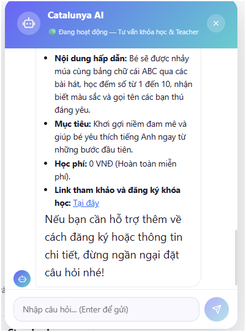
</div>

- **Tư duy:** Không chỉ là một wrapper gọi API AI đơn thuần, hệ thống sử dụng **Semantic Kernel** để điều phối quy trình RAG.
- **Giá trị:** AI có khả năng truy xuất tri thức từ kho dữ liệu nội bộ (Courses, Policies, Teacher Packages) để đưa ra phản hồi chính xác, giảm thiểu hiện tượng "ảo giác" (Hallucination).

### 📈 9.2 Học tập thích ứng (Adaptive Learning - SM-2)

<div align="center">
  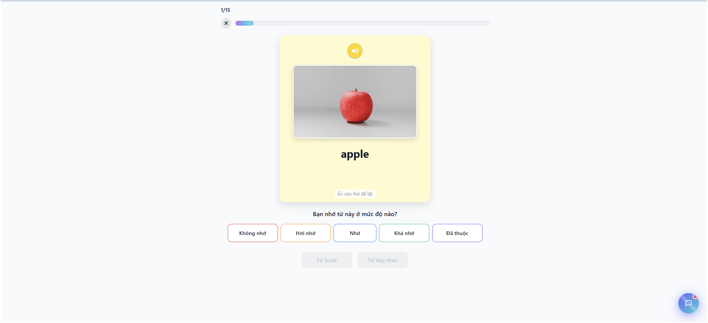
</div>

- **Cơ chế:** Hiện thực hóa thuật toán **SuperMemo-2 (SM-2)** để tự động hóa việc cá nhân hóa lộ trình ôn tập.
- **Giá trị:** Hệ thống tự động tính toán thời điểm "vàng" (Interval) để nhắc nhở người dùng ôn tập lại từ vựng/kiến thức dựa trên chất lượng phản hồi, tối ưu hóa việc ghi nhớ dài hạn.

### 👩‍🏫 9.3 Mô hình SaaS "Teacher Empowerment"

<div align="center">
  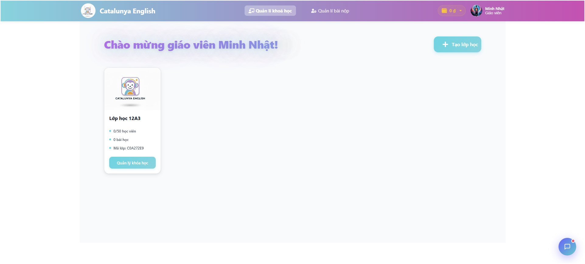
</div>

- **Cơ chế:** Cung cấp giải pháp **Software-as-a-Service** cho giáo viên. Mỗi giáo viên có thể sở hữu không gian quản lý riêng, lớp học riêng và các gói dịch vụ (Teacher Packages).
- **Giá trị:** Hệ thống quản lý chặt chẽ hạn ngạch tài nguyên (Quotas) và các gói đăng ký, cho phép nền tảng mở rộng quy mô kinh doanh không giới hạn.

### 💳 9.4 Fintech Wallet & Auto-Payment

<div align="center">
  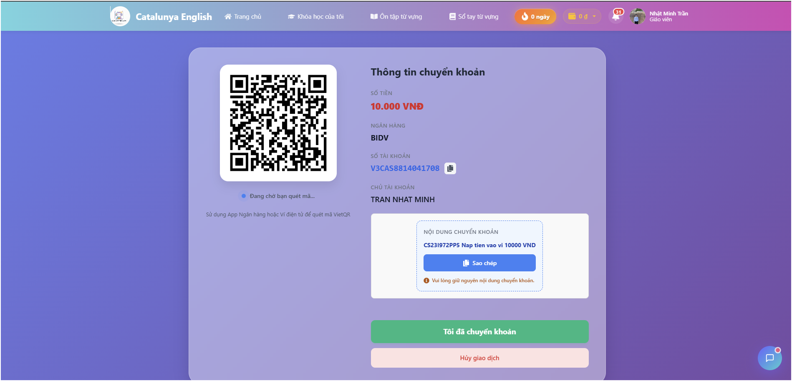
</div>

- **Cơ chế:** Tích hợp cổng thanh toán **PayOS (QR Code)** với quy trình cộng tiền tự động. 
- **Giá trị:** Đảm bảo tính toàn vẹn dữ liệu tài chính thông qua cơ chế **Idempotency Webhook** và hệ thống **Audit Trail** ghi lại mọi biến động số dư ví (Balance History).

### 🎤 9.5 Chấm điểm phát âm bằng AI (AI Pronunciation Assessment)

<div align="center">
  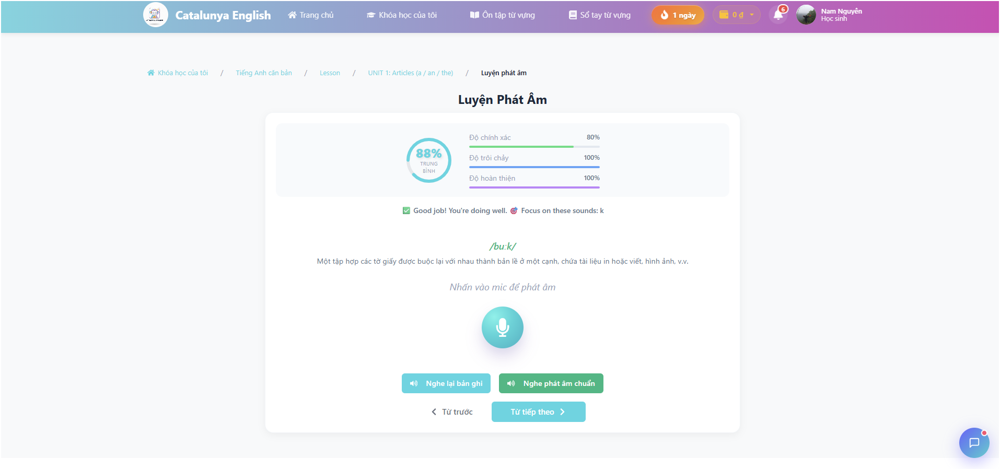
</div>

- **Cơ chế:** Tận dụng sức mạnh của **Azure Speech Services** để nhận diện và phân tích phổ thanh âm theo thời gian thực.
- **Giá trị:** Cung cấp phản hồi chi tiết tới từng âm tiết (Phonemes) bao gồm độ chính xác, độ trôi chảy và ngữ điệu, giúp học sinh tự luyện nói chuẩn bản xứ mà không cần giáo viên kèm 1-1. *(Lưu ý: Đối với kỹ năng Viết - Essay, hệ thống đề cao sự tương tác nên sử dụng cơ chế Giáo viên chấm thủ công có phản hồi chi tiết).*

---

## 📸 10. Thư viện Giao diện (UI Gallery)

Dưới đây là một số giao diện nổi bật khác của hệ thống, thể hiện sự chỉn chu từ UX/UI đến tính năng:

<details>
  <summary><b>1. Không gian Học tập & Bài giảng</b> (Click để mở rộng)</summary>
  <br/>
  <div align="center">
    <i>Trang tổng quan khóa học</i><br/>
    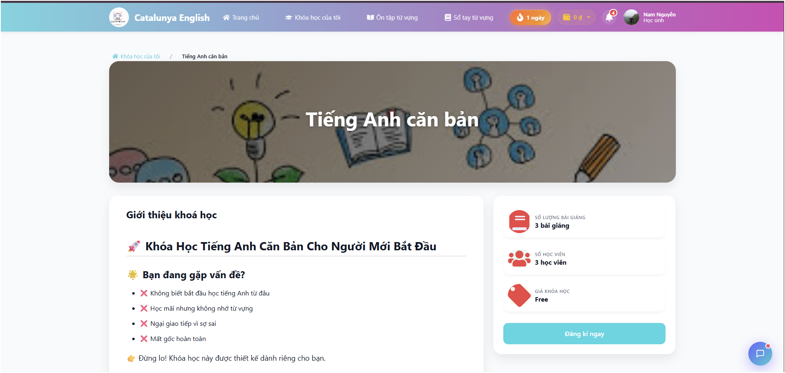<br/><br/>
    <i>Giao diện học bài và xem Video</i><br/>
    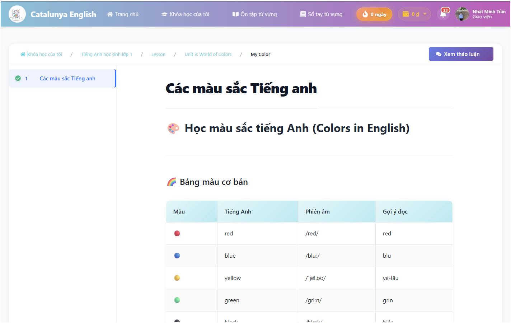
    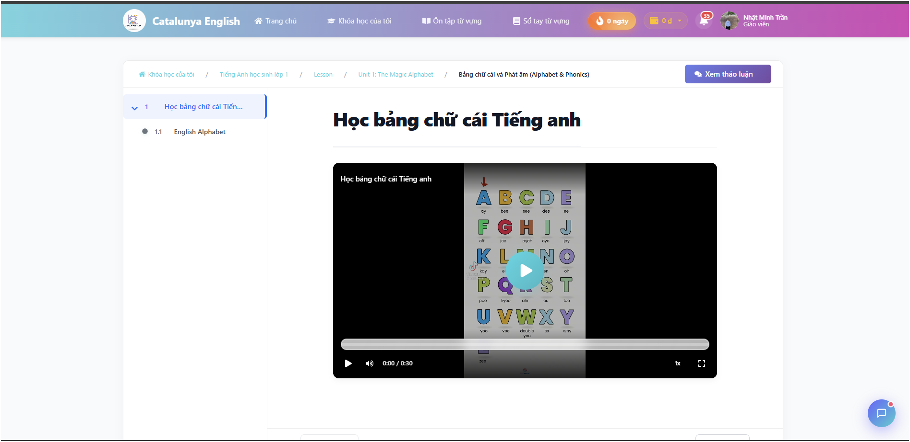<br/><br/>
    <i>Giao diện làm bài và kết thúc Quiz</i><br/>
    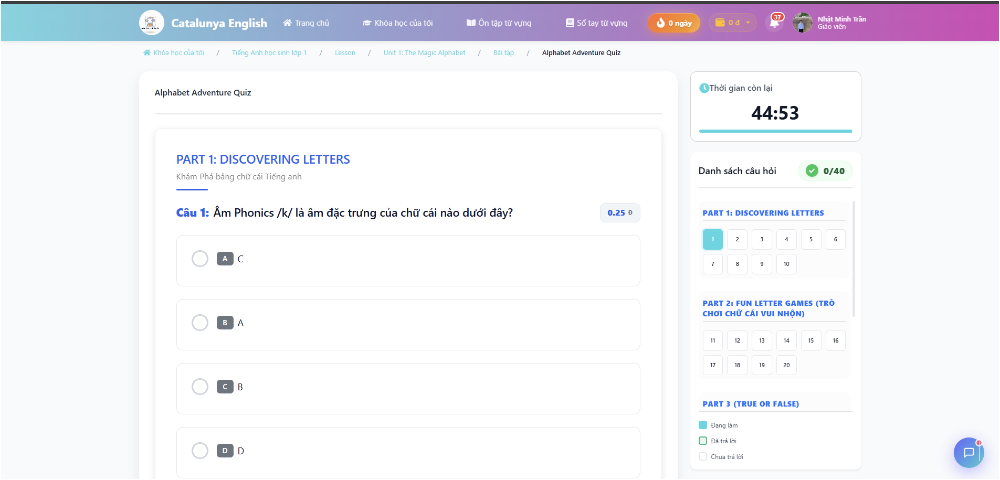
    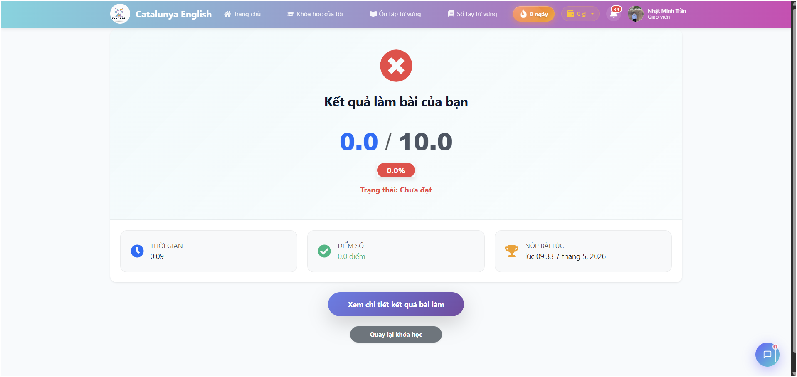
  </div>
</details>

<details>
  <summary><b>2. Quản trị Hệ thống & SaaS Dashboard</b> (Click để mở rộng)</summary>
  <br/>
  <div align="center">
    <i>Dashboard Tổng quan (Doanh thu, Học viên)</i><br/>
    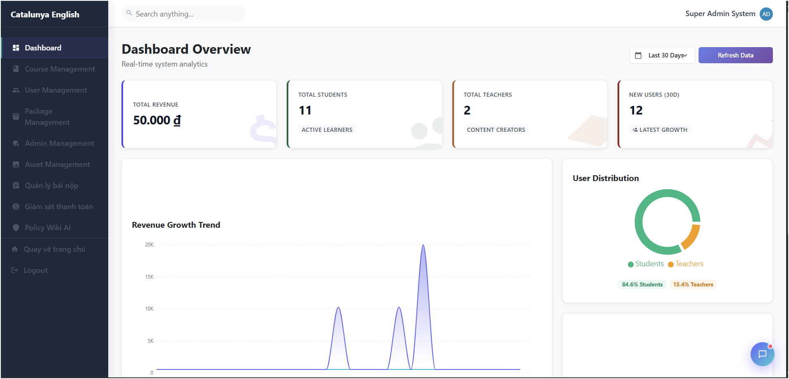<br/><br/>
    <i>Quản trị phân quyền động (RBAC) & Người dùng</i><br/>
    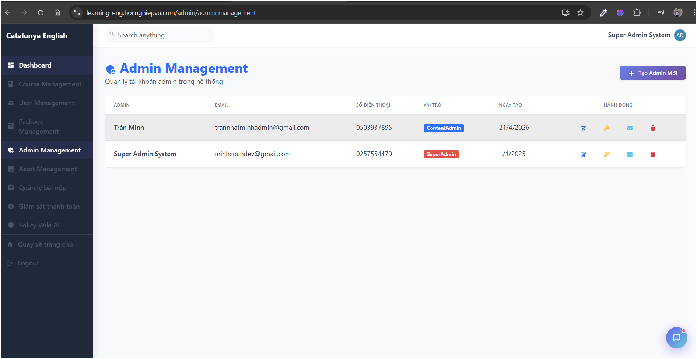
    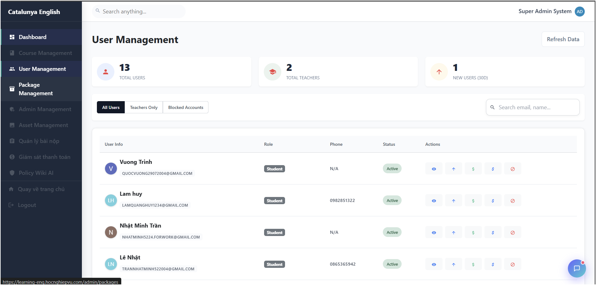<br/><br/>
    <i>Quản trị danh sách khóa học và Bài nộp (Teacher)</i><br/>
    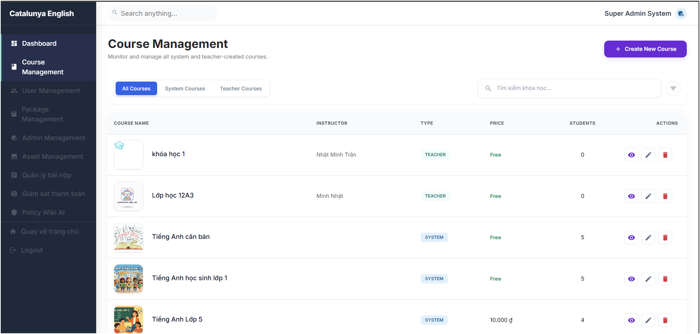
    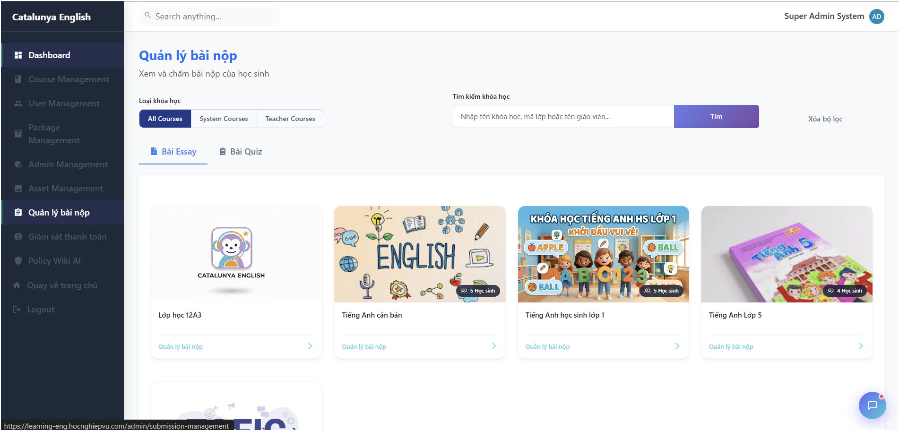
  </div>
</details>

<details>
  <summary><b>3. Cá nhân hóa, Tài chính & Lịch sử (User Portal)</b> (Click để mở rộng)</summary>
  <br/>
  <div align="center">
    <i>Lịch sử giao dịch và biến động số dư cá nhân</i><br/>
    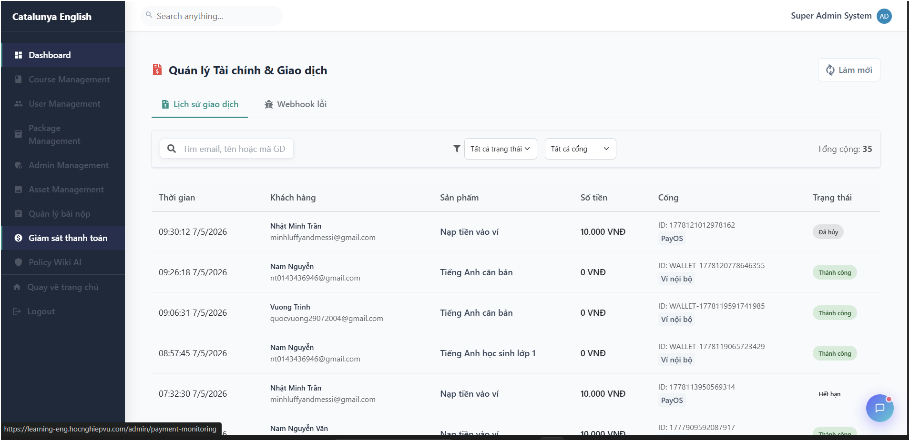<br/><br/>
    <i>Giao diện nạp tiền và lịch sử nạp tiền vào ví</i><br/>
    
    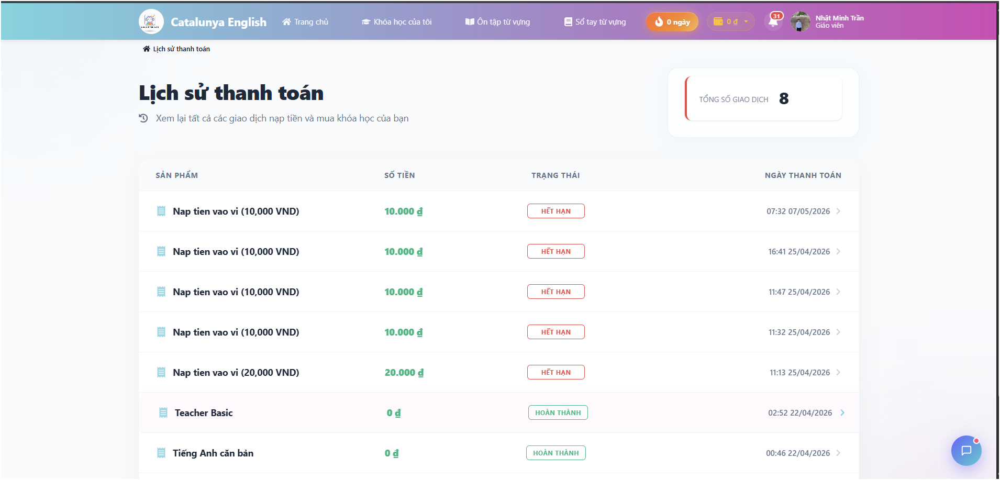<br/><br/>
    <i>Thống kê lịch sử làm bài và tiến trình học tập</i><br/>
    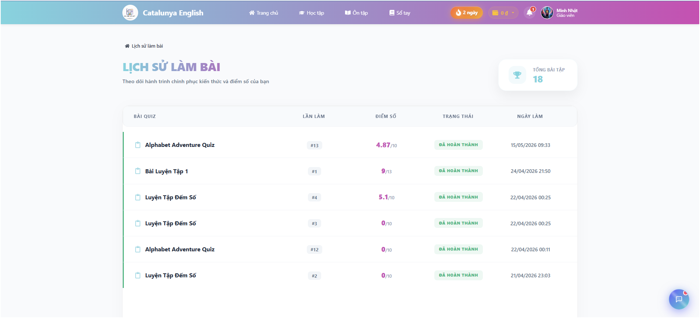
  </div>
</details>

---

## 🚀 Hiệu suất & Tối ưu hóa (Lighthouse Audit)

Hệ thống được kiểm tra và tối ưu hóa chuyên sâu để đáp ứng các tiêu chuẩn khắt khe nhất của **Core Web Vitals**, đạt được những con số ấn tượng trên cả thiết bị di động và máy tính:

<div align="center">
  
  
  
  
  
</div>

### 📊 Chi tiết các chỉ số cốt lõi (Core Web Vitals)

| Chỉ số | Kết quả (Desktop) 💻 | Kết quả (Mobile) 📱 | Ý nghĩa kỹ thuật |
| :--- | :---: | :---: | :--- |
| **Performance Score** | **97 / 100** | **85 / 100** | Trạng thái nạp trang tối ưu (Vùng xanh). |
| **Total Blocking Time** | **0 ms** | **20 ms** | Gần như không có hiện tượng giật lag khi tải JS. |
| **Largest Contentful Paint**| **1.0 s** | **3.6 s** | Nội dung chính hiển thị cực nhanh. |
| **SEO** | **100 / 100** | **100 / 100** | Tối ưu hóa tìm kiếm tuyệt đối. |

### 🛠 Các chiến lược tối ưu hóa (Performance Tuning)
1.  **Lazy Loading Third-party Scripts:** Sử dụng Custom Hook `useScript` để trì hoãn nạp Google/Facebook SDK, giúp giảm 99% TBT trên Mobile (từ 3060ms xuống 20ms).
2.  **Infrastructure Optimization:** Cấu hình **Nginx Gzip (Level 6)** và **Browser Caching (1 year)** giúp nén dữ liệu truyền tải và nạp trang tức thì khi quay lại.
3.  **Image & Resource Priority:** Áp dụng `loading="lazy"` cho ảnh phụ và `fetchpriority="high"` cho các thành phần quan trọng (LCP). Sẵn sàng cấu trúc hỗ trợ WebP.
4.  **JS Code Splitting:** Triển khai React `lazy` và `Suspense` cho toàn bộ hệ thống Routes (60+ trang) và các widget nặng như Chatbot.
5.  **Font & DNS Optimization:** Sử dụng `preconnect` cho Google Fonts và CDN để giảm thời gian chờ DNS/Font-load, loại bỏ hiện tượng giật chữ (FOIT).

### 📸 Minh chứng thực tế

<div align="center">
  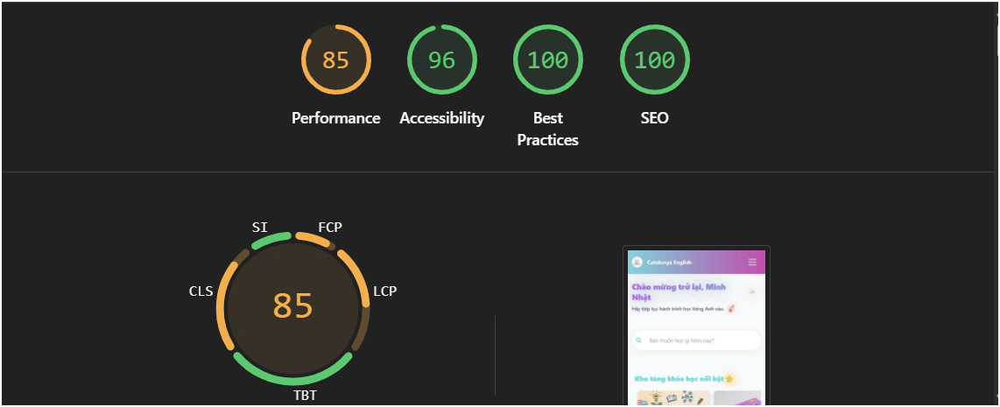
  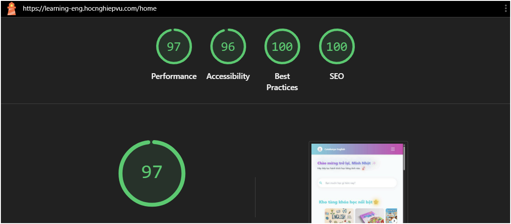
</div>


## 🛡 Đảm bảo chất lượng & Bảo mật (QA & Security)

Hệ thống được thiết kế và kiểm thử nghiêm ngặt để đảm bảo tính sẵn sàng cao (High Availability) và bảo mật tuyệt đối cho dữ liệu người dùng.

### 🔍 Tối ưu hóa SEO & Khả năng tìm kiếm (Search Engine Optimization)
- **Dynamic Metadata:** Triển khai **`react-helmet-async`** quản lý Meta Tags động, giúp Google index chính xác từng khóa học.
- **Dữ liệu cấu trúc (Schema.org):** Tích hợp **JSON-LD Schema** hiển thị Rich Snippets (số sao, giá tiền) trên kết quả tìm kiếm.
- **Social Branding:** Cấu hình Open Graph (Facebook) và Twitter Cards với ảnh đại diện chia sẻ link chuyên nghiệp.
- **Sitemap & Indexing:** Tự động hóa `sitemap.xml` và `robots.txt` chuẩn domain, tối ưu hóa quy trình thu thập dữ liệu của Google Bot.
- **User Analytics:** Tích hợp **Google Analytics 4 (GA4)** với cơ chế Lazy-loading (3s delay) để đo lường hành vi người dùng mà không ảnh hưởng đến điểm hiệu năng Lighthouse.

### 📈 Kiểm thử áp lực & Giới hạn chịu tải (Stress Testing)
Hệ thống đã vượt qua các bài kiểm tra áp lực cực hạn bằng **k6** để xác định dung lượng tối đa:
- **Ngưỡng tải ổn định:** Vượt qua mức **2,000 người dùng truy cập đồng thời** (Concurrent Users) mà không suy giảm hiệu năng.
- **Khả năng xử lý:** Đạt trung bình **~900 Requests Per Second (RPS)**, xử lý thành công hơn 26 vạn yêu cầu trong 5 phút.
- **Độ tin cậy:** Tỉ lệ lỗi duy trì ở mức **0.00%**; độ trễ p(95) chỉ **252ms** ngay cả ở mức tải cực đại.

### 🔐 Bảo mật hạ tầng & Dữ liệu (Infrastructure Security)
- **Hardened Nginx:** Triển khai các Header bảo mật chuyên sâu (`CSP`, `HSTS`, `X-Content-Type-Options`, `X-Frame-Options`) chống Clickjacking và XSS.
- **Data Integrity:** Cơ chế kiểm tra dữ liệu đầu vào nghiêm ngặt, đảm bảo an toàn cho các giao dịch tài chính (Top-up).
- **Audit Trail:** Hệ thống ghi vết biến động số dư ví (Balance History) giúp đối soát và ngăn chặn gian lận.

### 📸 Minh chứng thực tế (Evidence)
<div align="center">
  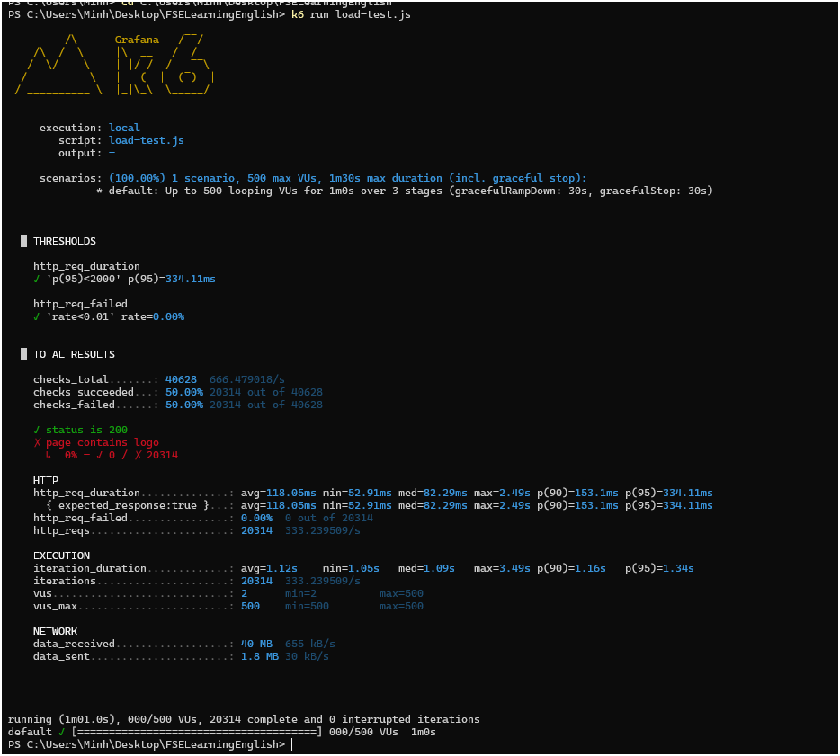
  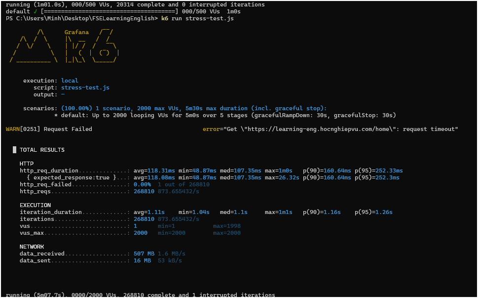
</div>


## 🤝 Liên hệ (Contact)
- **Author:** Trần Nhật Minh
- **LinkedIn:** [linkedin.com/in/trannhatminh05022004](https://www.linkedin.com/in/trannhatminh05022004/)
- **Facebook:** [facebook.com/Trannhatminh05022004](https://www.facebook.com/Trannhatminh05022004/)
- **Phone:** 0862359426
- **Email:** nhatminh5224.forwork@gmail.com
- **Project URL:** [https://github.com/TranNhatMinh5224/FSELearningEnglish](https://github.com/TranNhatMinh5224/FSELearningEnglish)

---
<div align="center">
  Made with ❤️ by Trần Nhật Minh
</div>
